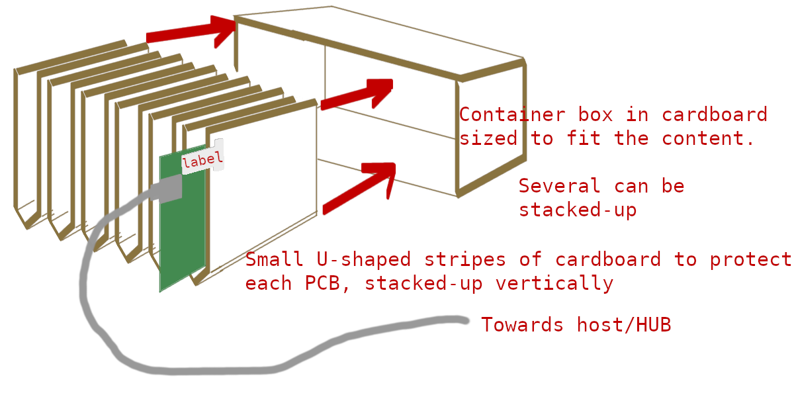
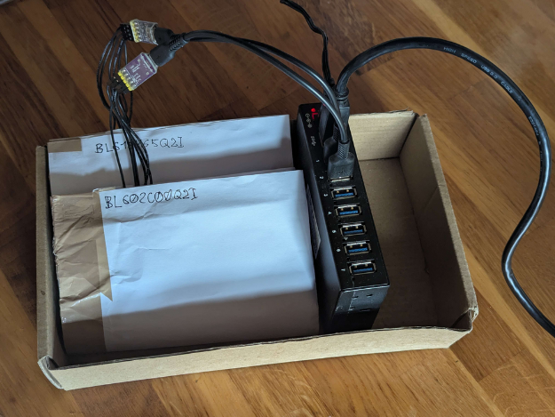
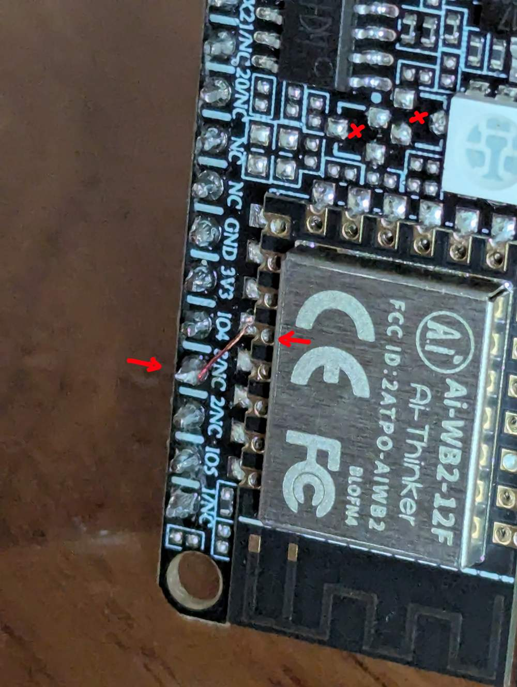

Zephyr test Rig for BouffaloLab
===============================

This is a set of scripts for testing various boards and publish the results periodically.

It uses one USB UART adapter per board:

- Power supply via GND and 3.3V pin
- TX and RX for bootloader or runtime
- DTR/RTS pin for BOOT and RESET toggling

## Preparing

Clone with west:

```
mkdir ~/zephyrproject
cd ~/zephyrproject
west init -m git@github.com:josuah/zephyr_test_rig
west update
```

You need to patch twister for DTR/RTS handling
(note that `west patch clean` might silently discard your uncommitted data):

```
west patch apply
```

## Debugging

Here is a pure-twister command that is expected to do something:

```
west twister --device-testing --log-level DEBUG --flash-before \
   --platform ai_m61_32s_kit --scenario samples.basic.helloworld \
   --west-flash=--dev-id=/dev/ttyACM0 --device-serial=/dev/ttyACM0
```

It is possible to add `--log-level DEBUG` to the `west bflb-test run` command.

All commands are printed before being run.

It is also possible to test using `west flash --dev-id=/dev/ttyACM0` which is expected
to reboot the board in bootloader mode on its own.

## Running tests

Example session:

```
# Initialize the rig
west bflb-test init rig0

# Add two boards
west bflb-test set /dev/ttyACM0 ai_m61_32s_kit
west bflb-test set /dev/ttyACM1 ai_wb2_12f_kit

# Run various tests, results will be stored in the repo
west bflb-test run -- -T samples/hello_world/ --log-level DEBUG

# Publish the tests results
west bflb-test push
```

See `west bflb-test` help text for full usage.

## Rig construction

Example of compact/cheap setup that scales reasonably well:





Connection diagram:

```
-------------.                         .--------------
            === GND ------------- GND ===
            === 3V3 ------------- 3V3 ===
   USB      === TX --------------- RX ===     DUT
   UART     === RX --------------- TX ===
            === RTS ---------- RESETN ===
            === DTR ------------ BOOT ===
-------------'                         '--------------
```

**Using the WeACT USB-UART, I have to unplug the DTR line, then power the board,
then plug DTR, or it would not toggle.**

Using `/dev/serial/by-id/...` instead of `/dev/ttyACM0`

### `ai_wb2_12f_kit`

This board often does not have the `BOOT` pin exposed due to absent transistors.

An external USB-UART adapter is used instead of the built-in one, and the missing
BOOT signal is broken out from the module to a pin header.


